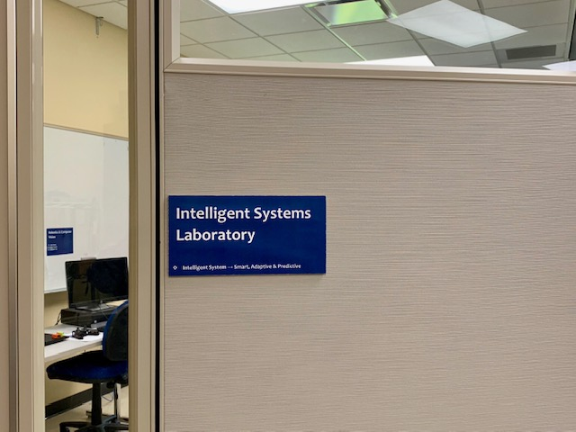

# Dr. Sudhir Shrestha

Dr. Sudhir Shrestha is an Associate Professor of Electrical Engineering at California State University, Sonoma State (SSU). He holds a Ph.D. and a bachelor's degree in Electrical Engineering. Prior to joining SSU, he held academic and research positions at Miami University (OH) and Purdue University in Indianapolis, and held technical roles in the private sector in Nepal.

## Areas of Expertise

- Sensing Breath VOCs for Diabetes
- Robotics
- Artificial Intelligence (AI)
- Embedded Computing
- Biomedical Devices

### Highlights

He holds seven patents and has authored more than 35 publications. Dr. Shrestha is a tenured professor at SSU and a Senior Member of IEEE. He has received research awards, including NSF Smart and Connected Health and CSU Biotech Faculty Research grants.

#### Appointments

* **2017 – Present**: Sonoma State University
    * Associate Professor (2021 – Present)
    * Chair, School of Engineering and Computer Science (ECS), 2024
    * Chair, Department of Engineering, 2022 – 2024
    * Assistant Professor (2017 – 2021)
* **2016 – 2017**: Miami University, Oxford, OH
    * Visiting Assistant Professor, Department of Electrical and Computer Engineering
* **2009 – 2016**: Purdue University, Indianapolis, IN
    * Assistant Research Professor (2011 – 2016)
    * Postdoctoral Researcher (2009 – 2011)
* **2004 – 2005**: Digital Link, Kathmandu, Nepal
    * Founder, Network, Systems & Hardware
* **2003 – 2004**: Vianet Communications, Kathmandu, Nepal
    * Network, Systems & Hardware Engineer

##### Education

1. **Ph.D. in Engineering (Electrical and Micro/Nanoscale Systems)**, Louisiana Tech University, 2009
2. **B.E. in Electrical and Electronics Engineering**, Kathmandu University, 2003

### Selected Publications & Presentations

- M. Boubin and S. Shrestha, “Microcontroller Implementation of Support Vector Machine for Detecting Blood Glucose Levels using Breath Volatile Organic Compounds,” Applied Science, vol. 19, no. XX, 2022.
- P. Vora and S. Shrestha, “Detecting Diabetic Retinopathy Using Embedded Computer Vision,” Applied Sciences, vol. 10, no. 20, pp. 1-10, Oct 2020.
- A. Siegel, A. Daneshkhah, D. Hardin, S. Shrestha, et al., “Analyzing Breath Samples of Hypoglycemic Events in Type 1 Diabetes Patients: Towards Developing an Alternative to Diabetes Alert Dogs,” Journal of Diabetes Science and Technology, vol. XX, pp. XX, 2021.
- A. Daneshkhah, S. Shrestha, et al., “Poly(Vinylidene Fluoride-Hexafluoropropylene) Composite Sensors for Volatile Organic Compounds Detection in Breath,” Sensors and Actuators B, Vol. 221, pp. 635-643, 2015.
- S. Shrestha, C. Harold, M. Boubin, and L. Lawrence, “Smart Wristband with Integrated Chemical Sensors for Detecting Glucose Levels Using Breath Volatile Organic Compounds,” in Smart Biomedical and Physiological Sensor Technology, 2020.
- Y.-T. Chen and S. Shrestha, “Source Classification of Indoor Air Pollutants using Principal Component Analysis for Smart Home Monitoring Applications,” 2018 IEEE International Conference on Electronics, Computing and Communication Technologies (CONECCT).
- Y.-T. Chen, et al., “Electronic Nose for Ambient Detection and Monitoring,” Proc. of SPIE Defense and Commercial Sensing Conference, Anaheim, CA, Apr. 9-13, 2017.
- S. Shrestha, et al., “Breast Tumor Detection by Flexible Wearable Antenna System,” International Journal of Computer Aided Engineering and Technology, vol. 4, no. 6, pp. 499-516, 2012.
- S. Shrestha, M. D. Balachandran, M. Agarwal, V. V. Phoha, and K. Varahramyan, “A Chipless RFID Sensor System for Cyber Centric Monitoring Applications,” IEEE Transactions on Microwave Theory and Techniques, vol. XX, pp. XX, 2015.
- M. D. Balachandran, S. Shrestha, et al., “SnO2 Capacitive Sensor Integrated with Microstrip Patch Antenna for Passive Wireless Detection of Ethylene Gas,” IEE Electronics Letters, vol. 44, no. 7, pp. 529-530, 2008.

### Patents

- A Device to Collect Breath Data from Type-2 Diabetes Patients in Real-Life Situations. US Patent Application 17508877 (Oct 22, 2021)
- Volatile Organic Compound Sensors, and Methods of Making and Using the Same. US 10107827 B1 (Published: Oct 22, 2018)
- Low Power Wireless Sensor System with Ring Oscillator and Sensors for Use in Monitoring of Physiological Data. US 2015 0295562 A1 (Published: Oct 14, 2015)
- Wearable Microstrip Antennas for Skin Placement for Biomedical Applications. US 9044158 B2 (Published: Jun 1, 2015)
- Paper-Based Lithium-Ion Batteries. US 9548496 B2 (Published: Jan 16, 2017), US 9531010 B2 (Published: Oct 17, 2016), US 9472832 B2
- Layer-by-Layer Assembled Nanoparticles Based Thin Films for Solar Cells and Other Applications. US 9444003 B2 (Published: Sep 12, 2016), UWO 2012 015989 A3 (Published: May 9, 2012)
- Transmission Delay Based RFID Tag. US 8179231 B1 (Published: May 14, 2012), US 8736452 B1 (Published: May 26, 2014; Filed: Mar 12, 2008)

### Intelligent Systems Lab (ISL)

The Intelligent Systems Lab (ISL) at SSU, led by Dr. Shrestha, focuses on research in smart sensing, embedded systems, and biomedical device innovation. For more information, visit the [ISL homepage](#) (add link).

<!-- To display the ISL image, uncomment the following line and provide the correct path if needed -->
<!--  -->

<!-- Example: For a large image, use the following -->
<!--  -->
